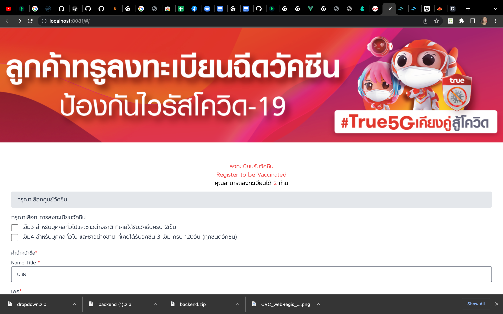
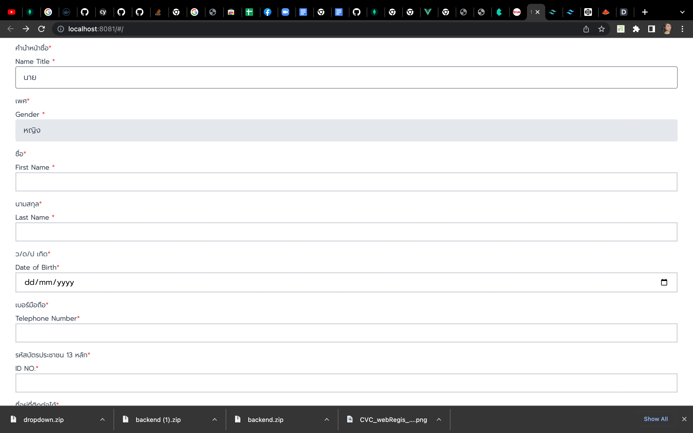
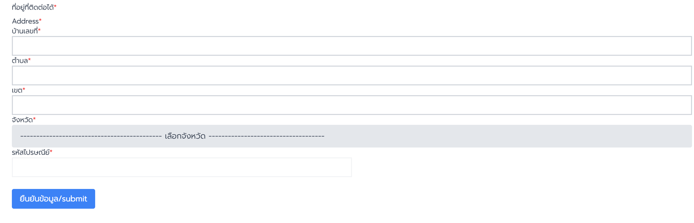
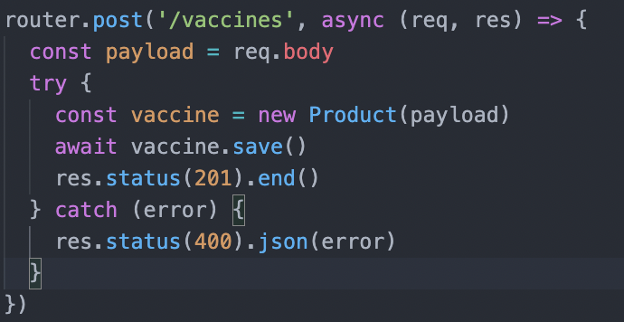
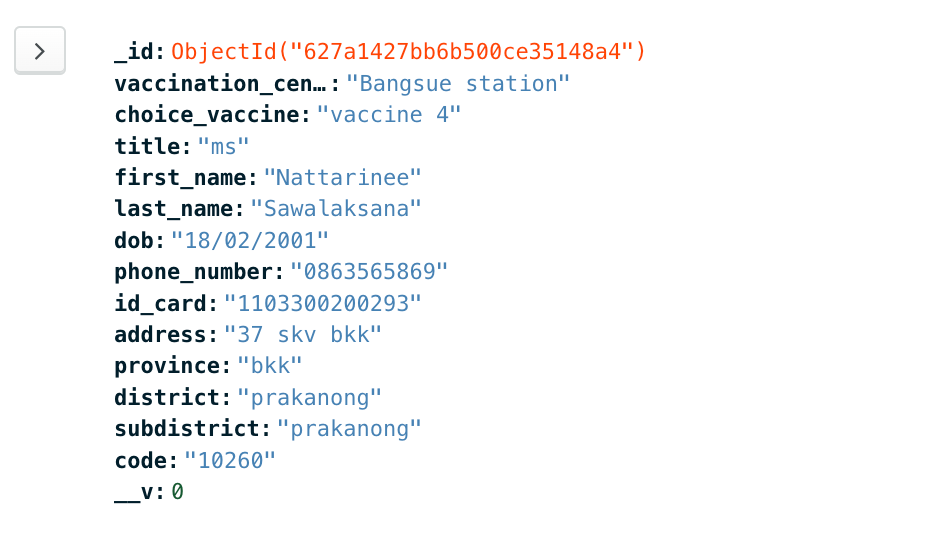
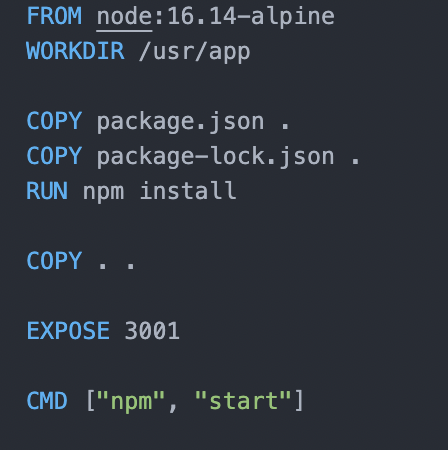
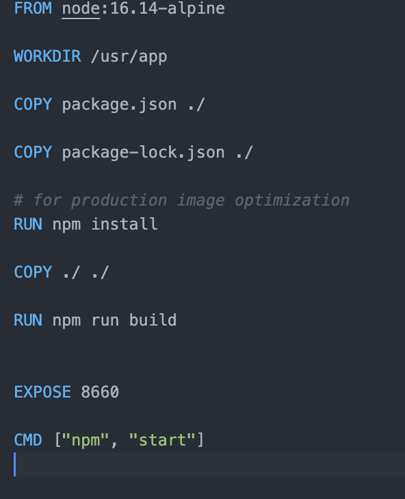

# Final วิชา Software Tools
# นางสาวณัฐริณีย์ เสาวลักษณ์ รหัสนักศึกษา 62070159


## วิธีดาวน์โหลดไฟล์
```
git clone https://github.com/angeldoppio/Final2022.git
```
## เปิด cmd ขึ้นมา
```
cd frontend
npm i
```

```
npm run dev
```

## เปิด cmd ขึ้นมาอีกอัน
```
cd backend
npm i
```

```
npm run dev
```

### เมื่อทำการกรอกข้อมูลในฟอร์มเสร็จแล้วข้อมูลจะไป post อยู่ใน

```
http://localhost:3001/vaccines
```

### Commit Message
```
<type>: <description>
```

## Description
```
- คำอธิบายเกี่ยวกับการ commit นั้น ๆ ที่อ่านแล้วสามารถเข้าใจว่า commit นั้นคืออะไร เกี่ยวกับอะไร
- ใช้เป็นภาษาอังกฤษ
- ความยาวไม่เกิน 75 ตัวอักษร
```

## ตัวอย่างการใช้งาน
```
add: new package.json file
```
## Feature: ระบบลงทะเบียนรับวัคซีน





เลือก Feature ระบบลงทะเบียนรับวัคซีนของค่ายโทรศัพท์ทรูมูฟ เอช ซึ่งประกอบด้วยข้อมูลต่างๆ ที่จำเป็นดังนี้

- ศูนย์วัคซีนที่ต้องการจะไปฉีด ซึ่งตาม Flow จะมีเพียงที่เดียว
- ระบุข้อมูลว่าจะฉีดเข็ม 3 หรือ เข็ม 4
- ระบุคำนำหน้าชื่อ 
- ระบุเพศ 
- ระบุชื่อ 
- ระบุนามสกุล 
- ระบุวันเดือนปีเกิด 
- ระบุเบอร์มือถือที่ติดต่อได้ 
- ระบุรหัสบัตรประจำตัวประชาชน 
- ระบุที่อยู่


## การวางแผนการออกแบบ
```
1. ออกแบบ Front-End ด้วย Framework ที่ชื่อว่า Vue.Js และ tailwindcss สาเหตุที่เลือกใช้ Vue เพราะว่าวิชา wev programming ได้มีการเรียนการสอน framework นี้ ทำให้เลือกเอามาประยุกต์ใช้กับวิชา Software Development Tools และเลือกใช้ Tailwind เพราะ เข้าใจง่าย
```
```
2. ออกแบบ Back-End ด้วย Node.js
```

### ตัวอย่าง


```
3. ออกแบบ Database ด้วย MongoDB เลือกใช้เป็น share database เนื่องจากมันฟรีและใช้งานง่าย
```

### ตัวอย่างข้อมูลเวลาเข้า Database


# เลือกใช้ Trello เป็น Project Management Tools เนื่องจากใช้งานง่ายและสะดวกสบาย
### ตัวอย่าง

## [Link to my Trello here!](https://trello.com/invite/b/ealUwc55/db350c61c68e33e556bc7cc5f638a710/feature-ระบบลงทะเบียนรับวัคซีน)


# มีการออกแบบ Acceptance Test ไว้ใน Google Sheet
#### ออกแบบไว้ 2 Testcase เนื่องจากเวลาไม่เพียงพอ
## [Link to my Acceptance Test here!](https://docs.google.com/spreadsheets/d/1mTHVkJEdpAAf9lOZjIoWqp19O_fAlb8oVNlgE5xVLhI/edit?usp=sharing)

### DockerFile



```
Back-End เลือกใช้ node version 16.14-alpine Expose Port ไปที่ 3001
Front-End เลือกใช้ node version 16.14-alpine Expose Port ไปที่ 8660
```
